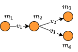
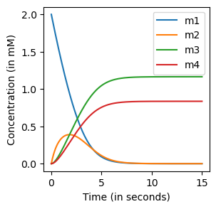
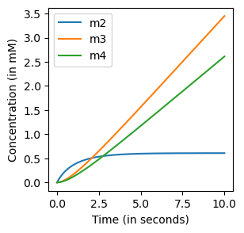
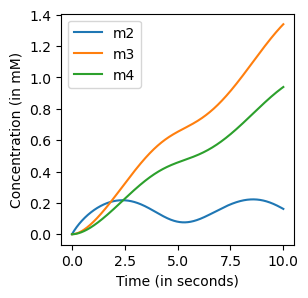

# Building models


## Metabolic kinetic modelling
The time evolution of metabolic states are often described by a set of 
Ordinary Differential Equations (ODEs):
$$\frac{dm(t)}{dt}=S\cdot v(t,m(t),\theta)$$

\\(S\\) is the stoichiometric matrix that describes the mass balances of 
a metabolic system. The fluxes \\(v\\) are described by reaction mechanisms, typically of some form like Michaelis-Menten or Hill equations. These mechanisms are parameterized by \\(\theta\\). By providing the initial values of the metabolic states, the ODEs can be solved using a numerical solver:
$$m(T)=m(0)+\int_0^T S\cdot v(t,m(t),\theta)dt$$

We will describe below how you can build your own models that are compatible with Jax/Diffrax[^1].


## The `Reaction` object

##### A reaction-centric approach
Models can be built in a reaction-centric manner. Initializing a `Reaction` object requires five inputs: name of the reaction, names of the species involved, stoichiometry of the reaction, compartments of the species involved, and the reaction's mechanism. 

```python
{!code/building_models.py!lines=1-18}
```
The `mechanism` is another class that describes the flux function, which depends on metabolite states and parameters. Parameters are pointed towards with unique symbols. The reaction object is implemented in a way that own-implemented flux functions can be used. We have also implemented a set of general flux functions that are often used in systems biology. 

##### Table of implemented mechanisms
| **Type of Reaction**             | **Name (in JAX class)**                         | **Number of Parameters**  |
|----------------------------------|-------------------------------------------------|---------------------------|
| A → B                            | Jax_MM_Irrev_Uni                                | 2                         |
| A → B                            | Jax_MM_Irrev_Uni_w_modifiers                    | 2 + modifiers              |
| A ↔ B                            | Jax_MM_Rev_UniUni                               | 4                         |
| A →                              | Jax_MM_Sink                                     | 2                         |
| A →                              | Jax_MA_Irrev                                    | 1                         |
| A ⇒                              | Jax_Facilitated_Diffusion                       | 3                         |
| A ⇒                              | Jax_Diffusion                                  | 2                         |
| A + B → C                        | Jax_MM_Irrev_Bi                                | 3                         |
|                                  | Jax_MM_Irrev_Bi_w_Inhibition                    | 3                         |
|                                  | Jax_MM_Irrev_Bi_w_modifiers                     | 3 + modifiers              |
| A + B ↔ C + D                    | Jax_MM_Rev_BiBi                                | 6                         |
|                                  | Jax_MM_Rev_BiBi_w_Inhibition                    | 7                         |
|                                  | Jax_MM_Rev_BiBi_w_Activation                    | 9                         |
| A + B ↔ C + D                    | Jax_MA_Rev_Bi                                  | 2                         |
| A ↔ B + C                        | Jax_MM_Rev_UniBi                               | 5                         |
| A + B → C + D + E                | Jax_MM_Ordered_BiTri                           | 7                         |
| A + B → C + D                    | Jax_ADH                                        | 15                        |
| A → B + C                        | Jax_Hill_Bi_Irreversible_Activation             | 7                         |
| A → B + C                        | Jax_Hill_Irreversible_Inhibition                | 7                         |

## Building simple models

#### A simple metabolic network example
Here, we show an example of how to build kinetic models using the reaction objects described above. We model the following network:



Three metabolic fluxes need to be modelled
```python
{!code/building_models.py!lines=20-53}
```
The stoichiometric matrix is automatically constructed from the reactions.

         v1   v2   v3
    m1 -1.0  0.0  0.0
    m2  1.0 -1.0 -1.0
    m3  0.0  1.0  0.0
    m4  0.0  0.0  1.0

One can first jax.jit the model[^2] and solve the ODEs using the diffrax package[^1], which contains many nice numerical solvers.

```python
{!code/building_models.py!lines=54-75}
```



<span style="font-size: 0.8em;"><b>Figure 1:</b> ODE simulation.</span>

#### On jit-compiling kinetic models
When you simulated a jit-compiled kinetic model for a certain time-range (e.g., `jnp.linspace(0,10,1000)` and you want to elongate this, it is best to not change the number of timepoints (e.g, `jnp.linspace(0,1000,1000)`. Otherwise, the kinetic models needs to be recompiled.  
## Boundary conditions
Boundary conditions can be either constant or not constant. Both are implemented as a `BoundaryCondition` class
#### Constant boundary conditions
Suppose for the system above, we want to make metabolite \\(m_1\\) a constant boundary condition. We can redefine the species by replacing it with a value


```python
{!code/building_models.py!lines=74-100}
```




<span style="font-size: 0.8em;"><b>Figure 2:</b> ODE simulation with \\(m1=constant\\).</span>

#### Non-constant boundary conditions
For non-constant boundary conditions, you can use the `BoundaryCondition` class as before. You can use for example the interpolation abstract classes from [Diffrax](https://docs.kidger.site/diffrax/api/interpolation/). For analytic expression dependent on time t, these can be done as follows:

```python
{!code/building_models.py!lines=103-126}
```


<span style="font-size: 0.8em;"><b>Figure 3:</b> ODE simulation with \\(m1=0+5+0.3*sin(t)\\).</span>

## Changing the numerical solver

The default solver is `diffrax.kvaerno5`, but diffrax offers many other numerical solvers that might be more
efficient for your purposes. Solvers can therefore be changed as follows.

```python
{!code/building_models.py!lines=129-131}
```

## Building custom models
When building kinetic models, it is not uncommon that \\(\frac{dm(t)}{dt}\\) is not fully based on the evaluation of \\(S\cdot v(t)\\). For these cases, one can still use the kinetic mechanisms described above but with a manual setup of the ODEs. We have provided a custom implementation of glycolysis in [Custom models](glycolysis.md) as an example.


## Saving models
One a model is built, it can be exported to sbml.
```python
{!code/building_models.py!lines=132-139}
```

## References
[^1]: Kidger, P. (2022). On neural differential equations. arXiv preprint arXiv:2202.02435.

[^2]: Bradbury, J., Frostig, R., Hawkins, P., Johnson, M. J., Leary, C., Maclaurin, D., ... & Zhang, Q. (2018). JAX: composable transformations of Python+ NumPy programs.
