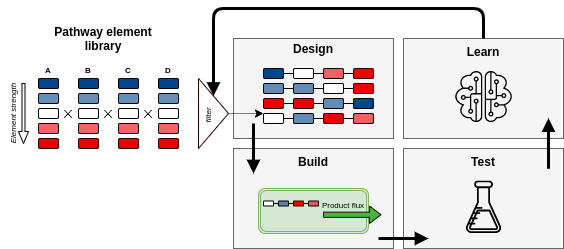
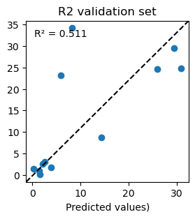

# Simulated design-build-test-learn-cycles

## A simulation of metabolic engineering experiments
DBTL cycles are widely used in the optimization of microorganisms for producing valuable compounds 
in a sustainable way. Despite the widespread use, many open questions exist when it comes to effectively 
using DBTL cycles. The reason for this is that due to the costly nature (in terms of time and money), 
effectively comparing design choices is never considered. 
It is for example highly unlikely that for the same optimization process, 
different sampling scenarios are compared, even though this might be valuable. 
An alternative cheap way to answer these types of questions is by simulating DBTL cycles[^1]. Here, we show a reimplemented software of simulated-DBTL in Jax/Diffrax[^2]. This allows users to test scenarios for their own lab settings. 



<span style="font-size: 0.8em;"><b>Figure 1:</b> The design-build-test-learn cycle of iterative metabolic engineering, a widely adopted paradigm for strain engineering.</span>

## Usage
Import required functions
```python
{!code/simulated-dbtl.py!lines=1-5}
```

We first choose a kinetic model that we consider only as a black-box that outputs some target value. 
From this model scenarios are simulated that might be encountered in real metabolic engineering. 
At the heart of this implementation is the `DesignBuildTestLearnCycle` class. 
This requires setting the initial parameters (the reference state), initial conditions, 
the timespan of process, and the target that we wish to simulate.

```python
{!code/simulated-dbtl.py!lines=6-22}

```

#### Design phase
We now set up the combinatorial pathway optimization experiment. 
We define some parameter targets that we want to perturb. 
Then, each target gets some "promoter" values that perturb the parameters by 
multiplication. Library transformation have a fixed number of positions in the strain. The 
`design_assign_positions` can be used to assign the library 'cassettes' to each position. 
If no assignment is set, this defaults to all library units being set for each position. 
Then, we assign probabilities to each promoter-parameter values. If this function is empty, each promoter-parameter is equally probable. 
Finally, we generate the designs, for 50 samples and 6 chosen pro-parameter elements. 
```python
{!code/simulated-dbtl.py!lines=23-36}

```

#### Build/Test phase
In the build phase we simulate all the designs and add a noise model to the outcomes for the target. The first simulation will take quite long, but after that it is compiled. If you do not run the class `DesignBuildTestLearnCycle` again, the simulations remain fast. The values that are taken in the dataset is the average of the last 10 datapoints of the target state variable.

```python
{!code/simulated-dbtl.py!lines=37-47}
```

#### Learn phase
From here, the produced data can be used to compare whatever hyperparameter of the DBTL cycle you are interested: the performance of ML models, DoE v.s. Random sampling, etc.. As an example, we train an XGBoost model on the set of generated datapoints, as well as a quick validation on newly generated strain designs.
```python
{!code/simulated-dbtl.py!lines=48-70}
```



<span style="font-size: 0.8em;"><b>Figure 2:</b> Model performance (true versups predicted values).</span>
 


## References
[^1]: van Lent, P., Schmitz, J., & Abeel, T. (2023). Simulated design–build–test–learn cycles for consistent comparison of machine learning methods in metabolic engineering. ACS Synthetic Biology, 12(9), 2588-2599.
[^2]: Kidger, P. (2022). On neural differential equations. arXiv preprint arXiv:2202.02435.
