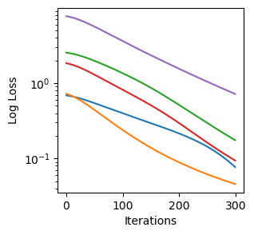

# Training metabolic kinetic models
Here, we showcase an parameter optimization process with simulated data **[1]**.

## The `Trainer` object
The `Trainer` object requires a few inputs. First, it requires a `SBMLModel` or a `NeuralODEBuild` object to be used. The second input is a datasets to fit on. Here, we show the fitting of a previously reported Serine Biosynthesis model **[1]** .

#### Setting up the trainer object + training
First, we load the necessary functions 

```python
{!code/training_models.py!lines=1-7}
```

Then, we load the model, data and initialize the trainer object. 

```python
{!code/training_models.py!lines=7-18}
```
We next perform a latin hypercube sampling for a certain initial guess, with lower and upperbound defined with respect to these values. We want five initializations (normally this should be higher).

```python
{!code/training_models.py!lines=18-25}
```


To initiate training, you simply call the function `Trainer.train()`

```python
{!code/training_models.py!lines=25-36}
```




<span style="font-size: 0.8em;"><b>Figure 1:</b> Loss per iteration for five initializations.</span>
#### Additional rounds
Suppose the fit is not to your liking, or we first want to do a pre-optimization of a large set of parameters and then filter promising sets, 
one can continue the optimization by re-running the `trainer` object with the set of optimized parameters.

```python
{!code/training_models.py!lines=38-53}
```


<span style="font-size: 0.8em;"><b>Figure 2:</b> Loss per iteration for five initializations, extended with 500 rounds of gradient descent.</span>
## References
[1] Smallbone, K., & Stanford, N. J. (2013). Kinetic modeling of metabolic pathways: Application to serine biosynthesis. Systems Metabolic Engineering: Methods and Protocols, 113-121.
