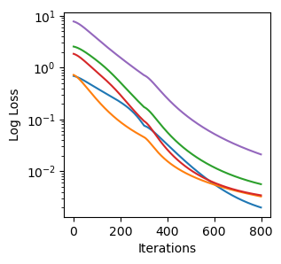

# Training metabolic kinetic models
Here, we showcase an parameter optimization process with simulated data **[1]**.

## The `Trainer` object
The `Trainer` object requires a few inputs. First, it requires a `SBMLModel` or a `NeuralODEBuild` object to be used. The second input is a datasets to fit on. Here, we show the fitting of a previously reported Serine Biosynthesis model **[1]** .

#### Setting up the trainer object + training
First, we load the necessary functions 

```python
{!code/training_models.py!lines=1-7}
```

Then, we load the model, data and initialize the trainer object. 

```python
{!code/training_models.py!lines=7-18}
```
We next perform a latin hypercube sampling for a certain initial guess, with lower and upperbound defined with respect to these values. We want five initializations (normally this should be higher).

```python
{!code/training_models.py!lines=17-25}
```


To initiate training, you simply call the function `Trainer.train()`

```python
{!code/training_models.py!lines=25-36}
```


<span style="font-size: 0.8em;"><b>Figure 1:</b> Loss per iteration for five initializations.</span>
#### Additional rounds
Suppose the fit is not to your liking, or we first want to do a pre-optimization of a large set of parameters and then filter promising sets, 
one can continue the optimization by re-running the `trainer` object with the set of optimized parameters.

```python
{!code/training_models.py!lines=35-53}
```



<span style="font-size: 0.8em;"><b>Figure 2:</b> Loss per iteration for five initializations, extended with 500 rounds of
gradient descent.</span>

## Trainer configurability
### Optimization in logarithmic or linear space
Optimization in logarithmic space has shown to work well for systems biology models[2] and is implemented as the default. 
To change to using gradient descent in a linear parameter space, you can restart the `Trainer` object. 
When the loss function is not specified (see below), a mean squared error loss is used.


```python
{!code/training_models.py!lines=53-55}
```

### Optimizer choices
Jaxkineticmodel is compatible with optimizers from [optax](https://optax.readthedocs.io/en/latest/). To use these, simply
pass the optimizer to the `Trainer` object (with required arguments). 
```python
{!code/training_models.py!lines=56-59}
```

### Customize loss functions
Jaxkinetic model uses as a default a log-transformed parameter space and a mean centered loss function. However, users
may want to present their own custom loss. 

```python
{!code/training_models.py!lines=60-89}
```
The loss function has mandatory arguments `params`,`ts`,`ys`. All other required arguments (e.g., `to_include`) are 
passed to `trainer._create_loss_func()`

NOTE: the use of custom loss function can depend on whether you perform your optimization in log-space or not. If 
you want to perform a custom loss function in log-space, you need to exponentiate your parameters within 
the loss function.

### Future configuration options
We aim to further add configurability of the adjoint option from Diffrax.  


## References
[1] Smallbone, K., & Stanford, N. J. (2013). Kinetic modeling of metabolic pathways: Application to serine biosynthesis. Systems Metabolic Engineering: Methods and Protocols, 113-121.

[2] Villaverde, A. F., Fröhlich, F., Weindl, D., Hasenauer, J., & Banga, J. R. (2019). Benchmarking optimization methods for parameter estimation in large kinetic models. Bioinformatics, 35(5), 830-838.